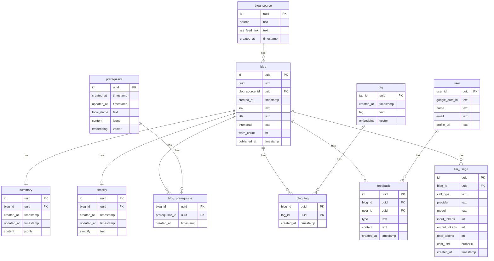

# DB Schema: Engineering Blog Aggregator

## Tables

### user
| Column | Type |
|--------|------|
| user_id | uuid (PK) |
| google_auth_id | text |
| name | text |
| email | text |
| profile_url | text |

**Reasoning:** `user` and `blog` are independent — `user_id` is not in the blog table because the same blogs are displayed to all users. No per-user content.

---

### blog_source
| Column | Type |
|--------|------|
| id | uuid (PK) |
| source | text |
| rss_feed_link | text |
| created_at | timestamp |

**Reasoning:** Company/source information does not belong in the `blog` table — `blog` should only contain blog-level attributes. `blog_source` is a separate table. The relationship is one-to-many: one source can have many blogs, but one blog belongs to exactly one source. The foreign key (`blog_source_id`) lives on the "many" side, i.e., in the `blog` table.

---

### blog
| Column | Type |
|--------|------|
| id | uuid (PK) |
| guid | text (UNIQUE) |
| created_at | timestamp |
| link | text |
| title | text |
| thumbnail | text |
| word_count | integer |
| published_at | timestamp |
| blog_source_id | uuid (FK → blog_source) |

**Reasoning:**
- `id` is a UUID generated by us — reliable, format-independent primary key and foreign key anchor.
- `guid` stores the RSS guid (externally-controlled string) — used exclusively for deduplication during polling. UNIQUE constraint prevents duplicate inserts. Not used as a PK or FK because RSS guid format varies by feed (full URLs, arbitrary strings, numeric IDs), making it unreliable as a relational anchor.
- `content:encoded` (full article text) is **not stored** — storing full copyrighted blog content raises legal concerns. Content is fetched on-demand when a user first requests a summary or simplify, the LLM result is stored, and the raw content is discarded.
- `thumbnail`, `word_count`, `title` are individual columns — each is a distinct blog attribute.
- `published_at` is the original article publish date from RSS (`pubDate`) — shown on summary/simplify pages as part of the attribution line.
- `blog_source_id` is the FK linking to `blog_source` — placed on the "many" side (blog table).

---

### summary
| Column | Type |
|--------|------|
| id | uuid (PK) |
| created_at | timestamp |
| updated_at | timestamp |
| blog_id | text (FK → blog) |
| content | jsonb |

**Reasoning:** Summary is a separate table for separation of concern. `created_at` is when the summary was first generated. `updated_at` is updated on every 7-day regeneration — the handler uses this to determine if a refresh is due. `content` stores the full LLM response as `{"short_summary": "...", "key_points": [...]}` — `jsonb` is used over `text` so Postgres validates JSON on insert and pgadmin renders it readably. Fields are always read together, never queried independently.

---

### simplify
| Column | Type |
|--------|------|
| id | uuid (PK) |
| created_at | timestamp |
| updated_at | timestamp |
| blog_id | text (FK → blog) |
| simplify | text |

**Reasoning:** Same reasoning as `summary`. `updated_at` tracks last regeneration for the 7-day refresh cycle.

---

### prerequisite
| Column | Type | Constraint |
|--------|------|------------|
| id | uuid (PK) | |
| created_at | timestamp | |
| updated_at | timestamp | |
| topic_name | text | UNIQUE |
| content | jsonb | nullable |
| embedding | vector(1536) | |

**Reasoning:** One row per prerequisite topic. `topic_name` has a UNIQUE constraint — the same topic cannot have duplicate rows, enabling LLM output to be stored once per topic and shared across all articles that reference it. `content` is nullable — it is populated on first user click (on-demand), not at ingest. At ingest, only `topic_name` and `embedding` are written. `content` stores the full LLM response as `{"definition": "...", "why_it_matters": "...", "example": "...", "deep_dive": "..."}` — `jsonb` is used over `text` so Postgres validates JSON on insert and pgadmin renders it readably. `updated_at` tracks last regeneration for the configurable refresh cycle (default 7 days). `embedding` stores the topic name's vector representation — used at ingest time to find similar existing prerequisites via cosine similarity (threshold: 0.88) before inserting a new row.

---

### blog_prerequisite
| Column | Type | Constraint |
|--------|------|------------|
| blog_id | text (FK → blog) | PK |
| prerequisite_id | uuid (FK → prerequisite) | PK |
| created_at | timestamp | |

**Reasoning:** Blog and prerequisite have a many-to-many relationship — one blog can have many prerequisites, one prerequisite can belong to many blogs. Many-to-many requires a junction/intermediate table. Composite PK on `(blog_id, prerequisite_id)` enforces that the same prerequisite cannot be linked to the same blog twice.

---

### tag
| Column | Type | Constraint |
|--------|------|------------|
| tag_id | uuid (PK) | |
| created_at | timestamp | |
| tag | text | UNIQUE |
| embedding | vector(1536) | |

**Reasoning:** One row per tag — `tag` column stores a single tag value (e.g., `"kafka"`, `"scaling"`). Storing multiple tags in one column would violate 1NF (values must be atomic). Unique constraint on `tag` enforces at the DB level that the same tag cannot have duplicate rows — normalization before insert handles this in practice, but the constraint is the safety net. `embedding` stores the tag's vector representation — used at ingest time to find similar existing tags via cosine similarity (threshold: 0.88) before inserting a new row.

---

### blog_tag
| Column | Type | Constraint |
|--------|------|------------|
| blog_id | text (FK → blog) | PK |
| tag_id | uuid (FK → tag) | PK |
| created_at | timestamp | |

**Reasoning:** Blog and tag have a many-to-many relationship — one blog can have many tags, one tag can belong to many blogs. Many-to-many requires a junction/intermediate table. Composite PK on `(blog_id, tag_id)` enforces that the same tag cannot be linked to the same blog twice.

---

### feedback
| Column | Type | Constraint |
|--------|------|------------|
| id | uuid (PK) | |
| blog_id | uuid (FK → blog) | |
| user_id | uuid (FK → user) | |
| type | text | enum: 'tag', 'prerequisite', 'summary', 'simplify' |
| content | text | |
| created_at | timestamp | |
| | | UNIQUE (user_id, blog_id, type) |

**Reasoning:** One feedback row per user per blog per type. `type` distinguishes between tag, prerequisite, summary, and simplify feedback — a user can submit all four types for the same blog independently. `content` stores free-text from the user. A row is only inserted if content is non-empty. Review is manual by admin — no auto-apply.

---

### llm_usage
| Column | Type | Constraint |
|--------|------|------------|
| id | uuid (PK) | |
| blog_id | uuid (FK → blog) | |
| call_type | text | enum: 'tag_prerequisite_extraction', 'summary', 'simplify', 'tag_embedding', 'prerequisite_embedding' |
| provider | text | e.g. 'anthropic', 'openai' |
| model | text | e.g. 'claude-sonnet-4-6', 'text-embedding-3-small' |
| input_tokens | integer | nullable — embeddings have no separate input/output split |
| output_tokens | integer | nullable |
| total_tokens | integer | |
| cost_usd | numeric(12,8) | |
| created_at | timestamp | |

**Reasoning:** One row per billable LLM/embedding call made during ingest — `call_type` distinguishes the 5 call sites in `ingest/handler.py` (the combined tag+prerequisite extraction call, summary generation, simplify generation, and one embedding call per tag/prerequisite normalized). Per-call rows (not per-run aggregates) preserve breakdown by call type — rollups to per-run or per-day totals are done via query, not baked into the schema. `cost_usd` is computed and stored at write time from a pricing table in `constants.py`, not derived at query time — this keeps historical rows accurate to what was actually paid even if pricing changes later. Only successful calls are logged; a failed `LLMUnreachableError` call has no usage data to record.

---

## ER Diagram

---

## Relationships Summary

| Relationship | Type |
|---|---|
| blog → blog_source | Many-to-one |
| blog → summary | One-to-one |
| blog → simplify | One-to-one |
| blog ↔ prerequisite | Many-to-many (via blog_prerequisite) |
| blog → blog_prerequisite | One-to-many |
| prerequisite → blog_prerequisite | One-to-many |
| blog ↔ tag | Many-to-many (via blog_tag) |
| blog → blog_tag | One-to-many |
| tag → blog_tag | One-to-many |
| blog → feedback | One-to-many |
| user → feedback | One-to-many |
| blog → llm_usage | One-to-many |
